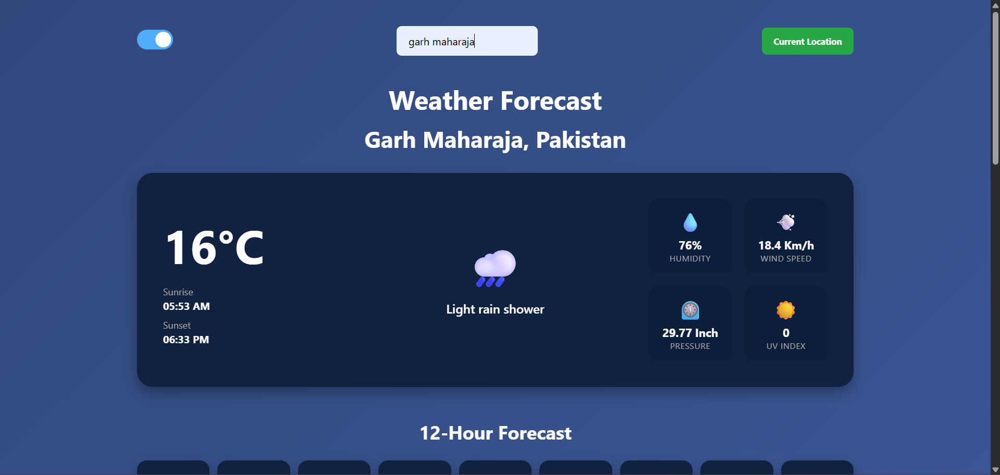

# 🌦️ Weather Dashboard: Real-Time Forecasts

**Stay ahead of the storm. A clean, responsive weather experience.**

  
  
  
  
  

***Sample Screenshot of the Dashboard 👇👇***

---

## 🚀 Overview

Welcome to the **Weather Dashboard**, a sleek web application designed to give you precise, real-time weather data at a glance. Built with a focus on clean UI and seamless performance, this project fetches live data from the **Open-Meteo API** to ensure you know exactly what’s happening outside—whether you're at home or searching for a city across the globe.

## ✨ Key Features

* 🌍 **Smart Geolocation:**
    * The app automatically detects your current coordinates upon loading to provide instant local weather.
* 🔍 **Global Search:**
    * Looking to travel? Type any city name into the search bar to get an instant forecast for that location.
* 🌓 **Dynamic Theme Toggle:**
    * Switch between **Light Mode** and **Dark Mode** with a single click. The UI is designed to be easy on the eyes, no matter the time of day.
* 📊 **Deep-Dive Metrics:**
    * Go beyond just the temperature. Get detailed data on **Humidity**, **Wind Speed**, **Surface Pressure**, and the **UV Index**.
* 🌅 **Astro Data:**
    * Stay synced with the sun. The dashboard provides accurate **Sunrise** and **Sunset** timings based on the local timezone.

## 🛠️ Technical Stack

* **Frontend:** Vanilla HTML5, CSS3 (using CSS Variables for themes), and JavaScript (ES6+).
* **APIs:** * [Open-Meteo](https://open-meteo.com/) for weather and UV data.
    * [BigDataCloud](https://www.bigdatacloud.com/) for reverse geocoding.

## 👨‍💻 Author
### Created by [Talha Pasha](https://github.com/thytalha)

---

## 📜 Status & Usage

> [!IMPORTANT]
> **Project Status:** In Progress

This project is currently **In Progress**. I am actively working on refining the UI and potentially adding a **7-day extended forecast** feature in the future.

### How to Use
* **Explore:** Feel free to dive into the code to see how the Fetch API handles real-time weather data.
* **Contribute:** Fork the repository or suggest new features via issues/pull requests!
* **Remix:** Whether you're learning or just need a solid weather template, you are welcome to use and modify this project.
